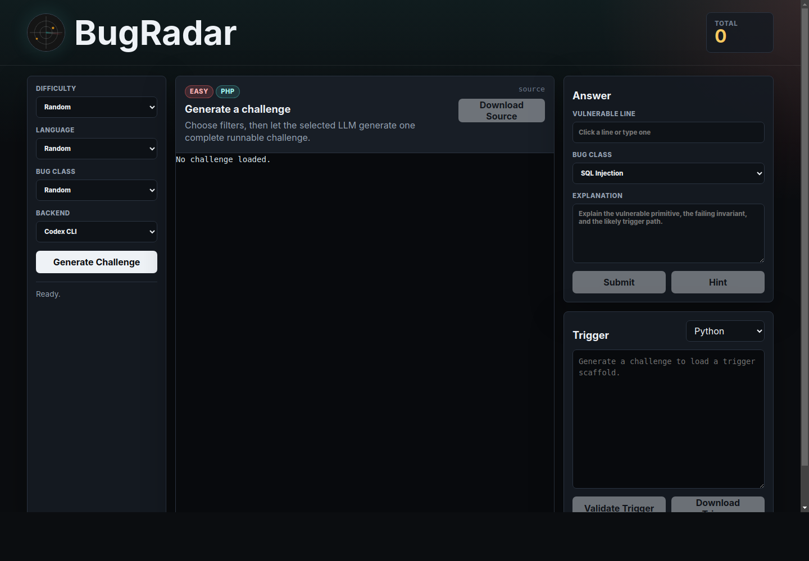

# BugRadar

BugRadar is a spot-the-bug interview prep game that uses local Codex or Claude CLI processes to generate complete runnable source challenges, score answers, and evaluate optional trigger code.



## Run

```sh
npm start
```

Open `http://127.0.0.1:3000`.

## Local CLIs

BugRadar does not accept provider API keys and does not use a local curated challenge catalog. Generation and scoring run through CLIs that are already authenticated on your machine:

```sh
codex login
claude auth
npm start
```

Optional overrides:

```sh
BUGRADAR_CODEX_BIN=/path/to/codex BUGRADAR_CODEX_MODEL=gpt-5.5 npm start
BUGRADAR_CLAUDE_BIN=/path/to/claude BUGRADAR_CLAUDE_MODEL=sonnet npm start
```

The Codex path runs `codex exec`. The Claude path runs `claude -p`.

## Features

- One challenge at a time, generated by the selected CLI backend
- Easy, medium, hard, extreme, and random difficulty selection
- PHP, Python, C, C++, Rust, x86 assembly, and ARM assembly targets
- Source file, source description, hidden solution metadata, and progressive hints
- Syntax-highlighted source viewer with clickable vulnerable-line selection
- CLI-scored answer submission with visible loading states
- CLI-scored C/Python trigger-code panel for bonus points
- Source and trigger download buttons
